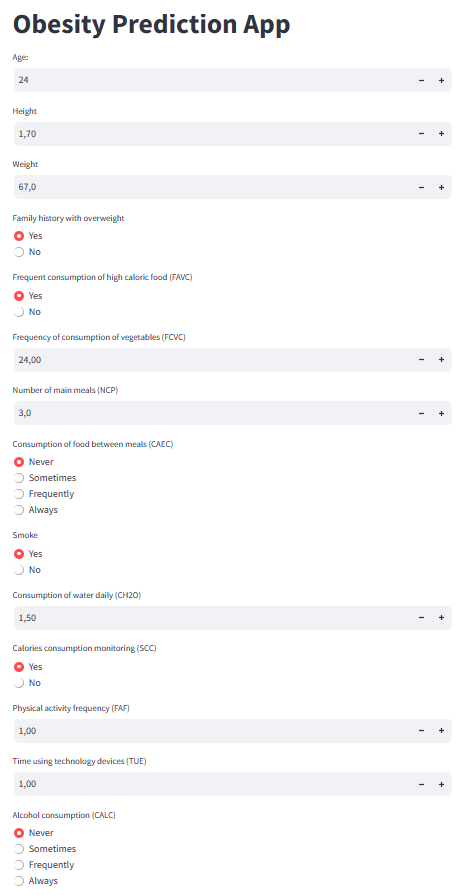
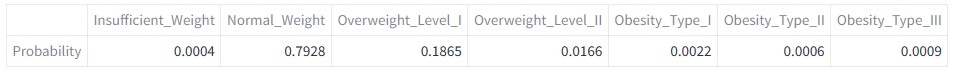

# Obesity Prediction App

## Overview

This project aims to predict obesity levels in individuals using a range of input features. Utilizing machine learning techniques, this model was trained in order to classify the obesity level based on personal, behavioral, and dietary data.

## Project Structure

- **Data Collection**: Data has been collected from various sources and anonymized to ensure privacy.
- **Dataset**: After rigorous cleaning and preprocessing, the dataset is ready for analysis and model training.
- **Model Training Notebook**: A Jupyter notebook detailing the process of exploratory data analysis, feature engineering, and model training.
- **Results**: The model provides probabilities for different categories of obesity, helping in understanding the risk levels.

## Dataset Description

The dataset includes various features such as age, height, weight, eating habits, physical condition, and so on. These features are utilized to predict the probability of belonging to one of the obesity categories defined by the World Health Organization.

### Features

- Demographic information (Age, Gender, etc.)
- Physical measurements (Height, Weight, etc.)
- Eating habits (Frequency of high caloric food intake, etc.)
- Physical activity (Frequency and intensity, etc.)

### Labels

- Obesity categories ranging from Insufficient Weight to Obesity Type III.

## How to Use

1. **Data Collection**: Gather your dataset, ensuring it's cleaned and formatted properly.
2. **Exploratory Data Analysis**: Use the Jupyter notebook to explore the data and identify patterns.
3. **Model Training**: Follow the steps in the notebook to train the model, adjusting parameters as necessary.
4. **Evaluation**: Utilize the model to predict obesity levels and interpret the probabilities.

## Screenshots

### Form View

_Screenshot of the input form where users enter their details._

### Prediction Output

_Screenshot of the output showing the prediction probabilities for different obesity categories._

## License

This project is shared under the MIT License, allowing for open use, modification, and distribution, encouraging innovation and collaboration in the field of health informatics.
